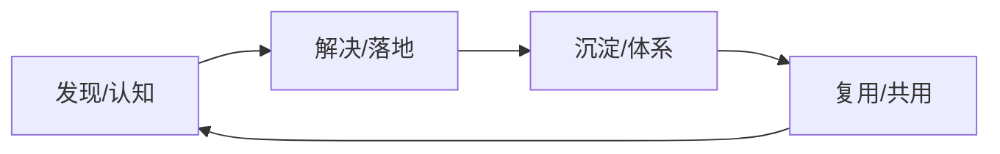

# 序引

中台这个事情众说纷纷, 有先驱者, 先知先觉, 有后发者, 后知后觉

阿里从supercell公司得到最初灵感, 然后在国内开始布道, 实际上我看过几篇'阿里中台实际上并没有很成功'的文档

# 中台的浅层思考

## 中台的意义

### 前驱性

#### 用户驱动

观察、聆听、互动、反馈用户

整理清洗分析推断用户的想法、说法

#### 需求驱动

对比类似已落地需求得到需求精确点

提升规模、深化含义、打造体系、降低成本

量化需求意义

版本化的尝试响应需求

否定已成熟、完善已成熟

#### 技术驱动

#### 体系驱动

#### 微调驱动

#### 理论驱动

#### 效率驱动

#### 链式驱动

### 可塑

思路: 与后台不一样的是, 中台必须为前台提供能够改变业务功能的方式

落地: 

​	提供个人空间, 允许尝试, 提高公平、公正、公开, 奖励并认可有价值的尝试

​	抽象已有形成元数据、数据、指令, 允许个人在个人的命名空间中修改元数据、数据、指令

​	提升开发工具的能力

​	组织内部人员需要更多价值观: 交付、开放、赋能、追求

### 先进

思路: 发现问题之后必然要解决问题

落地: 加大技术投入, 记录问题, 按照技术进度解决问题

### 重用

思路: 第1遍原始创造, 抽取第2遍发生的事情到中台上, 从中台上获取并填充到第3遍

落地: 鼓励第1遍创新, 抽取第2遍, 使用第2遍

### 融贯

思路: 1+1>2

落地:和其他产品/数据链接在一起, 产品/数据需要标准化、开放化
